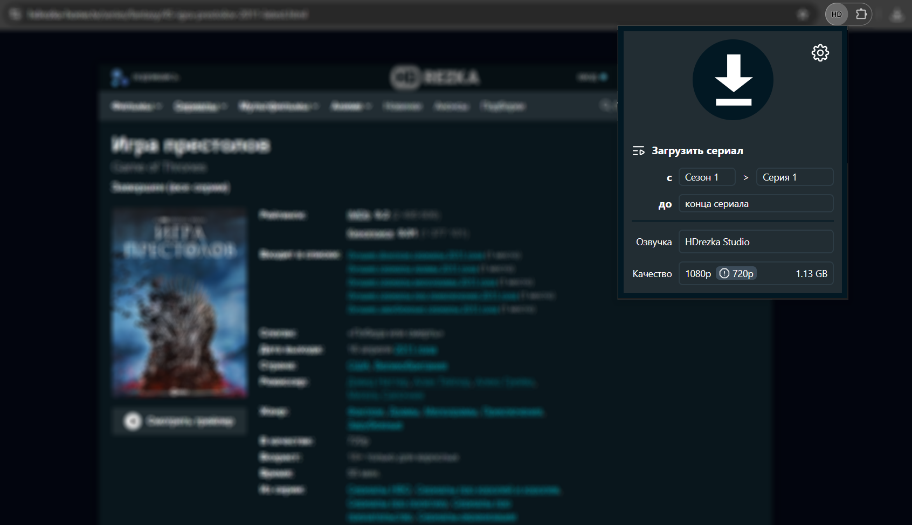

[![Russian][ru-flag]](README.md)
[![English][en-flag]](README-EN.md)
[![Ukrainian][ua-flag]](README-UA.md)

<div align="center">
  

  <br>
  
  
  

  <br>
  
  
  
  


  <h3>
    A simple solution for downloading your favorite movies and TV shows from <a href="https://rezka.ag"> rezka.ag</a>!
  </h3>
</div>

<p align="center">
  <a href="https://chromewebstore.google.com/detail/hdrezka-grabber/aamnmboocelpaiagegjicbefiinkcoal/" target="_blank">
    
  </a>
  <a href="https://addons.mozilla.org/firefox/addon/hdrezka-grabber/" target="_blank">
    
  </a>
  <a href="https://addons.opera.com/extensions/details/hdrezka-grabber/" target="_blank">
    
  </a>
  <a href="https://microsoftedge.microsoft.com/addons/detail/hdrezka-grabber/ngighangjonmjnbjbmbagfepbegpbndk/" target="_blank">
    
  </a>
</p>

## About extension

HDrezka Grabber is the best tool for downloading your favorite movies and TV shows from [rezka.ag](https://rezka.ag) and
all its mirrors! Control everything: choose audio tracks, subtitles, or download entire TV series with one click if
needed. Customize file naming templates for your media library and speed up the process with parallel downloads. An
intuitive interface with light and dark theme support, as well as availability for most browsers, makes this tool your
perfect assistant.

Table of Contents:

- [About extension](#about-extension)
- [Features](#features)
- [How to use it](#how-to-use-it)
- [Building from source](#building-from-source)
- [Installation in dev mode](#installation-in-dev-mode)
- [Disclaimer](#disclaimer)
- [Support](#support)
- [License](#license)

## Features

- Support for all official mirrors
- Ability to download entire TV series with one click
- Episode range selection available for TV series
- Subtitle download capability (including subtitles only, without video)
- Parallel downloading of multiple movies and TV series
- Downloads happen in the background and are not tied to the page
- Automatic detection of actual video quality with warnings about quality downgrading by the site
- Display of downloadable file size
- Allows creating custom templates for naming downloaded files
- Uses the browser's built-in downloader, so the extension downloads files directly to disk
- Dark and light themes are available
- Automatically pulls player data from the page

## How to use it

- Navigate to a movie or TV series page on [rezka.ag](https://rezka.ag)
- Click on the extension icon — a popup with download options will open
  
- Select the desired download options in the popup: voice over, quality, which episode/season to begin from and which
  episode/season to end the TV series download, as well as subtitles if available.
  
- Then start the download by clicking the large button with the arrow icon at the top of the popup.
- After a couple of moments, the download will begin, and instead of the arrow icon inside the button, the current
  progress will be displayed.
  
- Now you can repeat with another movie or TV series — the extension supports a download queue, which allows you to
  download several different movies/TV series simultaneously. And since the extension is capable of working in the
  background, you don't have to stay on the same page where you initiated the download.

> [!WARNING]
> The extension works in the browser; if you close the browser, the extension will also stop working!

## Building from source

### Prerequisites

- Node.js (latest version recommended)
- npm

> [!NOTE]
> You can install Node.js [here](https://nodejs.org/en/download).

### Steps

1. Clone the repository:

   ```bash
   git clone https://github.com/kristal374/HDrezka-Grabber.git
   cd HDrezka-Grabber
   ```

2. Install dependencies:

   ```bash
   npm ci
   ```

3. Build the extension:

- For Chromium-based browsers:
  ```bash
  npm run build:chromium
  ```
- For Gecko-based browsers:
  ```bash
  npm run build:firefox
  ```
- Build for all supported browsers:
  ```bash
  npm run build:dev
  ```
- Build and package into archives for distribution:
  ```bash
  npm run build:prod
  ```

## Installation in dev mode

Installing the extension in developer mode.

### For `Chrome`-based browsers:

- Open your browser and go to the extension page: `chrome://extensions`
- In the top right corner, enable **Developer mode**.
- Click the <kbd>Load unpacked</kbd> button.
- Select the extension files folder `dist/build/HDrezka-Grabber.chrome`
- The extension will appear in the list and be ready to use.

### For `Firefox`-based browsers:

- Open your browser and go to: `about:addons`
- Click on the gear icon, then select <kbd>Install Add-on From File</kbd>.
- Select the `manifest.json` file from the extension folder `dist/build/HDrezka-Grabber.firefox`.
- The extension will be loaded and available for use until the next browser restarts.

## Disclaimer

> [!CAUTION]
> This extension is distributed as free open-source software. It provides technical means for interacting with
> web content. The extension does not store or distribute third-party content — it only performs local operations
> in the browser at the user's request. The user independently bears full responsibility for the legality of using
> the extension in their jurisdiction and for compliance with the terms of use and license agreements of the
> respective websites.

## Support

Please consider making a donation to support the development of this open-source project.

<div align="left">
    <form action="https://www.paypal.com/donate" method="post" target="_top">
      <input type="hidden" name="hosted_button_id" value="HM5S5TFG3ZQVL" />
      <input type="image" src="https://pics.paypal.com/00/s/MzlmMWYzOTUtOGNhZi00MTE5LTllOGYtNzA0NzY3ODI2NDg5/file.PNG" border="0" name="submit" title="PayPal - The safer, easier way to pay online!" alt="Donate with PayPal button" />
      
    </form>
    <a href="https://www.buymeacoffee.com/kristal374" target="_blank">
        
    </a>
</div>

Additionally, you can give a 5-star rating on [Chrome web store][chrome-web-store] or [Mozilla add-ons][mozilla-addons]
and star this project on GitHub.

## License

[GPL-3.0](LICENSE)

[ru-flag]: https://img.shields.io/badge/Русский-RU-blue?logo=data:image/png;base64,iVBORw0KGgoAAAANSUhEUgAAADAAAAAkCAMAAAD4m0k4AAAA81BMVEVHcEzT09OdGhGkHhTR0dHV1dWbGRGZGBCgHBPV1dXR0dGcGRGgGxLU1NTU1NTQ0NCVFxHX19eTExOSEw3///8ANqPLIBUAMZwAPqrRJhrTKBsAM5/PJBjOIhfJHRMAOKbWLB8AOqcAQKsAL5nX19cARa4BQqyWFQ7VKh3WLyLR0dEBLJUAPKnGGxIASLACPpmiHBPc3NyvJR3FIxirHxbx8vSlFw8AJ4IAI3W3HRT4+fnKysq8KB/h4ubm5uY5LHFLeMMPOY+kuN91K1OPMUtcMGdjiMqLpdPu7u5OMG6DnM06ZrcOTLDM2O5/HjJ1mNKXKT/M21+YAAAAFHRSTlMAko/hWnFztlu24UiipEgQKCgU9g6UdlkAAAHuSURBVDjL5dVdV6JQGIZhNJXQ0j4MNc0cdcxJyRGk2hQikGBqH///1/S+7E2yEVpzPs9acuC6bjZLDxCEYKe5fOZYkqTjTD5fPq0IactJcKnkpX5sRSkDXQxXypni7ZNQRm3OV4ZRxRmGvpqb0/4trogn5nBwfhG+6EMAelXdX9DRjK0/nRvVKQTz6k8zdH0F0+n5/xDE9t8GJv54b86Ht8B5H77zpqd5fW1DYPqL7d3db9xgMOh2u/X6duOt9zrTWVw8PAr+BjT1lIOvj8djvGw3C2/tO47jr73NoFnr1SCYTHhfp/4X7hp2QddsNmuwMKB+x8f7PPA9FkRvH+V7ngWhT+ERT4PI46Tx0I9YwPtU3hthYE9C/xNnnga7x+d/mgQ/egwC8Pbr0n3BuctXy47zbz+y3iGYLF/+4Dqd4XCIn8vG86e7tOxa5PboLZfc3wgW1ZSjpmvANPXTxRMtC85/V+V2uw2B+hz1EY5rta6CyXS7oJPgW8F4HwbMp/CIZwHnGzvP8cArQcA9TpzzngVJPOH24GlAfUtjS+DfngUNjcxgf8PNZoRomizL/OMoCvxvEKgq4IOjbOEQV8geiQdhSAhRFKoJuQd9LpYExKWz2LvjpFTIQnfD7VwsoBMPU99P0AUniiKef0K/+wIhQsyL7kuw0wAAAABJRU5ErkJggg==
[en-flag]: https://img.shields.io/badge/English-EN-green?logo=data:image/png;base64,iVBORw0KGgoAAAANSUhEUgAAADAAAAAkCAMAAAD4m0k4AAABwlBMVEVHcEwAGVEEK2gCH1YAHVUBHlUAFEiqEzACHlYCIFinsrKfDya4tbmhFSyztr3ExsqkqLIjOWvMwcOfDygMM2ygDym6hI3KysoDDz+VACvZ2dkIG029dYOoV1+5ubm9i5Oyqqq6urq6foj////MFTfKETHHDiwAHWLLEzTFDiq+CyTBDSfDDSjIDy4AFlMBMnsAJG0BGFYBLnfOFzoBJm8AFk0AG1v+/v79/PwIKWgCH1wBLG7pp7HkkJ30ztXr7fPol6bmk6EFI2fsq7cLL3ORChwGIWDo6vDtsbu3CiABEkQAED4ONHrV2uXRHEO4GDl4hqqstszX19jgdolgcZn99/j46OzQJUWiCiA/WY7GFjL09fhofKX77O7aXXPzydHRUGPQNk/xxczmnajdZ3zc3eArQXnFzN3i4uXvusPWRWHggI/R0dP13eGgrMXNPVLJIDvAvsAvT4yHlLROaJtOX4T18vXDxszZV26vSFnQy8zuvcXNL0mLnL16j7b14ua4DSYjN2vhiZe0bHg2R3eZpMD12d6vWmY/UHwVP4PUb4LMvMDFeIfDh5GdNkK4OU3DUGvWm6bMkJ28dX7PsLXgz9H2/EKBAAAAI3RSTlMAhrOTYqGx/FV3BVD9mRT3+9tLvCpv4mgqBrHbIyOuxj+0xxxCV0cAAAQdSURBVDjLdZWHVyJJEMbHhJjD5r2wd9czjIeODiJhJIkgoAtIRpAcBBEBRTHnuHlvd+//va4hKe/2ew8er9/3q66qrqYJgtdTYU9HV3t7e1dHT6fwaS/xE73qe4O/B1+8HvIYVSAOPhznev5k4Fnfry3c4OhA990hMfra5XJlzbbQFK/p6WmVMfupG+vb0Eh7VxveUSjs7GkTjPQfrNzlD4nlr9/OlAgrE6gTVjQnJYPL/+Q5k8k0y0suv//w5Xzfm94ilpf9/pQWCOWJFexVAMugs87MzLDzvBy3cSaiRK414uNXv91u348CYttuAiRp0BlneLGs1XlUYlJepNyVEYV0WJ3DSMqHiUqoBpBkE2DZbZueYjYUSOGRyAiVdce5Go3Y7X4NlFKwtgAsO1P2RZhgEiFFiAbAODX17lQXzUmluVs+LVUVGOMBCG/xM/4ErtFD1wEeMfil9jlM6HaMGBgbA4BljWWfm2JiZwh5d+gqoKo2813hLCKVRsI4UhnNjdUAjxmHpza8uLwA/QCwBkInBTNKrK8nFNAuACiDLpC53WeYODTdtgZ+bneY4FTbpxn+5B5IP0ZRlEFZcZPV8MhppOkLj3PVtUfsOsHt1VrmNG63W6+3JDa9SE8BgMJRyxx/prbTmz0z/PhxQLiyyiN3zg4nBa2BXMjj4yrwWErtZXxlgfjw/hjmoOmHbCiKYRgyvu/WqC1akCW5ESuNj4sx0L3c8Dft4AeJRKK/QRNY49jfBBrptNgb/nHeXwfIR/6W6A/9NaDu/9/ozXQaAElK4ymNJaoNh8+0uJEbkWKw1V7zH3/vx8C+2odaDw7sxXhw4oE/mLvUItcWcXUILbY5y440WBOXyfUw0kNwNVKGtRa1BqQ+uoXzXS1fEPms7mbHii9VBi/43IwoqK8oasBj6ZwebuktMRxQwdQHdHjJUBKJUj7nGuwwMaGGOVRYkpYEsp2Edi8kkslJDMyawL+ziucJh/evZwP0PNJD7mqzAyOVmFgc8RU4CfhrAMuGcIK3ORGT8jk4GgMaqFVtNgUquL5kUFzSVxyzk3WAZSHSegmHz/BTDwDuDAbkazac1uaxWFyMZj2mOoD9Cj2Fs3fM0zVgvAbIOScM/8b54mIsUbm5x4B8FvuV70XBZPVSNQAxD0gkoQpsEltcXCwmfXsOQu5RIG9EVIoWOPohIAZAArqGtNBRESPnn++I+zTyxkTFzRAtr8uENDAHdUAyW+av8BHeZWGB2Et7Y+dftq5lTUlcH3G0BoCbc53hr9y/V58XiHz+YOWgf0TQ+F/vEvwydLWA9WlPIpNNViXz5NOHW1v9v/9BHB50D4wOPn46en/rezbw5Hm/bAn0ltfS7vCfL8D3V9+rnz1QvS+FnW0dXQKBAL9kwpfVxf8ABj55g+3Y6poAAAAASUVORK5CYII=
[ua-flag]: https://img.shields.io/badge/Українська-UA-blue?logo=data:image/png;base64,iVBORw0KGgoAAAANSUhEUgAAADAAAAAkCAMAAAD4m0k4AAAA1VBMVEVHcEzFnwC9lADBmwDFoAADVqACYKcASZrMpAAAZKsAVqACWaICWqIFYKcBUp3IpAC5kgDGoQAHWKC1lQC8kgD/1QD/zAD/1AD/zwAAZMD/0AD/2QAAWLn/yQD/1wAAXLwAXr0AYb8AZsEAaMIAbsUAWrv/0gAAcccAVbcAasMAU7UAbMQDXqYAUbO+lQAAYL7CnQTevwv+xgAAQpACaLQAXrHvwwPWqQAAUJ7QrQDTsgAAWaPitwA8e48ATrEobJuPnlGvsTzuzw1vimX2ywBHhY5BXVhJX/sAAAAAFXRSTlMAk6xzV1y0/v7+o492O9i7Ld0ZEPbmdQ7iAAACFElEQVQ4y43V13KqUBQGYCwIdmMCFoyagDFGVEBKFAy2c97/kbJ2oW6Zyc/IhfP9ay+4geNw2nyr2ajVao1mi2/3ucLwHbj1+VodR8fxdd/v1JotptfnG4IgcG2kbXulaUtN09Yr1bYdBzooHXwiCpzfEXA4u25rSxwNFdbrFURV33eO4/vfUQQBbpvPyfeeq9vL2K+JVyHvkNFo9AY9lMliNlssJulCPD7FoQDZzefzGfETISqQdcg2CUd+R/wC+7iQHp/hyXjsP2kh51M852khWodZnnKyPvJfUNDtrM/y1HjkcaFOfBFP1gG/IQXWM5x6UiA+/+ajbZJ1wG/2UHDSPvOs8fjY/+BC1rPbkHWwRwXfwX5khyeU0E4463/2/6Ggrv6dL1dpiiNJV/Nyvp1CqiknPrwZBuefLldFUaZKVJCmcEkD2tPJ+C89vJ1NWfYMzjAVagmnGQw+cMZD1zRNVx7CJePC0XzgB7Efo994CJGZAsuRpZx4Usj5PE/7V28bF/LLP+Dya1J4sHzCEx8XmHdT4KPCX8ZjTwuPx2c58RYUDmbWj4vHZwp/GA/eEqEQsONzPPFxAfz97uLc5QKOPC3c3eBwEKMYoncIAtdix1uBuIXC8Qj6qVuqVFEqpVL3ycARPei5loW06wYe6JdyjwNdqj7nvh09KOLeFl00L+UKct1q4ffpuYdOLKPA+T3y5y+LT8+ZR7lnbAAAAABJRU5ErkJggg==
[chrome-web-store]: https://chromewebstore.google.com/detail/hdrezka-grabber/aamnmboocelpaiagegjicbefiinkcoal
[mozilla-addons]: https://addons.mozilla.org/en/firefox/addon/hdrezka-grabber/
