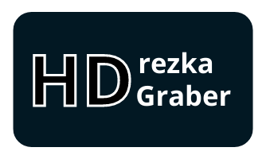

[![Russian][ru-flag]](README.md)
[![English][en-flag]](README-EN.md)
[![Ukrainian][ua-flag]](README-UA.md)

<div align="center">
  

  <br>
  
  
  

  <br>
  
  
  
  

  <h3>
    Простий спосіб завантаження улюблених фільмів та серіалів з <a href="https://rezka.ag">rezka.ag</a>!
  </h3>
</div>

<p align="center">
  <a href="https://chromewebstore.google.com/detail/hdrezka-grabber/aamnmboocelpaiagegjicbefiinkcoal/" target="_blank">
    
  </a>
  <a href="https://addons.mozilla.org/firefox/addon/hdrezka-grabber/" target="_blank">
    
  </a>
  <a href="https://addons.opera.com/extensions/details/hdrezka-grabber/" target="_blank">
    
  </a>
  <a href="https://microsoftedge.microsoft.com/addons/detail/hdrezka-grabber/ngighangjonmjnbjbmbagfepbegpbndk/" target="_blank">
    
  </a>
</p>

## Про розширення

HDrezka Grabber — найкращий інструмент для завантаження улюблених фільмів та серіалів із сайту
[rezka.ag](https://rezka.ag) та всіх його дзеркал! Контролюйте все: обирайте озвучку, субтитри або, за потреби,
завантажуйте цілі серіали в один клік. Налаштовуйте шаблони назв файлів для своєї медіатеки та прискорюйте процес
за допомогою паралельного завантаження. Інтуїтивно зрозумілий інтерфейс із підтримкою світлої та темної теми,
а також доступність для більшості браузерів роблять цей інструмент вашим ідеальним помічником.

Зміст:

- [Про розширення](#про-розширення)
- [Функціонал розширення](#функціонал-розширення)
- [Як користуватися розширенням](#як-користуватися-розширенням)
- [Збірка з вихідних кодів](#збірка-з-вихідних-кодів)
- [Встановлення в режимі розробника](#встановлення-в-режимі-розробника)
- [Відмова від відповідальності](#відмова-від-відповідальності)
- [Підтримка](#підтримка)
- [Ліцензія](#ліцензія)

## Функціонал розширення

- Підтримка всіх офіційних дзеркал
- Можливість завантаження всього серіалу в один клік
- Для серіалів доступний вибір діапазону серій для завантаження
- Є можливість завантаження субтитрів (зокрема лише субтитрів, без відео)
- Паралельне завантаження декількох фільмів та серіалів
- Завантаження не прив'язане до сторінки й відбувається у фоні
- Автоматичне визначення реальної якості відео з попередженням про заниження якості сайтом
- Відображення розміру файлу, що завантажується
- Дозволяє створювати власні шаблони для іменування файлів, що завантажуються
- Використовується вбудований завантажувач браузера, тому розширення завантажує файли одразу на диск
- Доступні темна та світла теми на вибір
- Автоматично підтягує дані плеєра зі сторінки

## Як користуватися розширенням

- Перейдіть на сторінку фільму або серіалу на сайті [rezka.ag](https://rezka.ag)
- Натисніть на іконку розширення — відкриється попап з опціями завантаження
  
- Оберіть бажані опції завантаження в попапі: озвучку, якість, з якої серії/сезону почати й на якій серії/сезоні
  закінчити завантаження серіалу, а також за наявності субтитри.
  
- Після чого запустіть завантаження, натиснувши на велику кнопку з іконкою стрілочки у верхній частині попапа.
- Через декілька мить почнеться завантаження, а замість іконки стрілочки всередині кнопки відображатиметься поточний
  прогрес.
  
- Тепер можете повторити з іншим фільмом або серіалом — розширення підтримує чергу завантажень, що дозволяє вам
  завантажувати одночасно декілька різних фільмів/серіалів. А оскільки розширення здатне працювати у фоні, вам не
  обов'язково залишатися на тій же сторінці, на якій ви ініціювали завантаження.

> [!WARNING]
> Розширення працює в браузері, якщо ви закриєте браузер, розширення також припинить роботу!

## Збірка з вихідних кодів

### Попередні залежності

- Node.js (рекомендується остання версія)
- npm

> [!NOTE]
> Встановити Node.js можна [тут](https://nodejs.org/en/download).

### Послідовність дій

1. Клонуйте репозиторій:

   ```bash
   git clone https://github.com/kristal374/HDrezka-Grabber.git
   cd HDrezka-Grabber
   ```

2. Встановіть залежності:

   ```bash
   npm ci
   ```

3. Запустіть збірку розширення:

- Для браузерів на базі Chromium:
  ```bash
  npm run build:chromium
  ```
- Для браузерів на базі Gecko:
  ```bash
  npm run build:firefox
  ```
- Збірка для всіх браузерів, що підтримуються:
  ```bash
  npm run build:dev
  ```
- Збірка та упаковка в архіви для розповсюдження:
  ```bash
  npm run build:prod
  ```

## Встановлення в режимі розробника

Встановлення розширення в режимі розробника.

### Для браузерів на базі `Chrome`:

- Відкрийте браузер і перейдіть на сторінку розширень: `chrome://extensions`
- У правому верхньому кутку увімкніть **Режим розробника**.
- Натисніть кнопку <kbd>Завантажити розпаковане розширення</kbd>.
- Оберіть папку з файлами розширення `dist/build/HDrezka-Grabber.chrome`
- Розширення з'явиться у списку та буде готове до використання.

### Для браузерів на базі `Firefox`:

- Відкрийте браузер і перейдіть за адресою: `about:addons`
- Натисніть на значок шестерні, а потім оберіть <kbd>Встановити додаток з файлу</kbd>.
- Оберіть файл `manifest.json` з папки розширення `dist/build/HDrezka-Grabber.firefox`.
- Розширення буде завантажено та стане доступним для використання до наступного перезавантаження браузера.

## Відмова від відповідальності

> [!CAUTION]
> Це розширення розповсюджується як вільне програмне забезпечення з відкритим вихідним кодом. Воно
> надає технічні засоби для взаємодії з веб-контентом. Розширення не зберігає і не розповсюджує контент
> третіх осіб — воно лише виконує локальні операції в браузері на запит користувача. Користувач самостійно
> несе повну відповідальність за законність використання розширення у своїй юрисдикції та за дотримання умов
> використання та ліцензійних угод відповідних вебсайтів.

## Підтримка

Будь ласка, розгляньте можливість зробити пожертву для підтримки розвитку цього проєкту з відкритим вихідним кодом.

<div align="left">
    <form action="https://www.paypal.com/donate" method="post" target="_top">
      <input type="hidden" name="hosted_button_id" value="HM5S5TFG3ZQVL" />
      <input type="image" src="https://pics.paypal.com/00/s/MzlmMWYzOTUtOGNhZi00MTE5LTllOGYtNzA0NzY3ODI2NDg5/file.PNG" border="0" name="submit" title="PayPal - The safer, easier way to pay online!" alt="Donate with PayPal button" />
      
    </form>
    <a href="https://www.buymeacoffee.com/kristal374" target="_blank">
        
    </a>
</div>

Крім того, ви можете поставити 5-зірковий рейтинг у [Chrome web store][chrome-web-store]
або [Mozilla add-ons][mozilla-addons] та відзначити цей проєкт на GitHub.

## Ліцензія

[GPL-3.0](LICENSE)

[ru-flag]: https://img.shields.io/badge/Русский-RU-blue?logo=data:image/png;base64,iVBORw0KGgoAAAANSUhEUgAAADAAAAAkCAMAAAD4m0k4AAAA81BMVEVHcEzT09OdGhGkHhTR0dHV1dWbGRGZGBCgHBPV1dXR0dGcGRGgGxLU1NTU1NTQ0NCVFxHX19eTExOSEw3///8ANqPLIBUAMZwAPqrRJhrTKBsAM5/PJBjOIhfJHRMAOKbWLB8AOqcAQKsAL5nX19cARa4BQqyWFQ7VKh3WLyLR0dEBLJUAPKnGGxIASLACPpmiHBPc3NyvJR3FIxirHxbx8vSlFw8AJ4IAI3W3HRT4+fnKysq8KB/h4ubm5uY5LHFLeMMPOY+kuN91K1OPMUtcMGdjiMqLpdPu7u5OMG6DnM06ZrcOTLDM2O5/HjJ1mNKXKT/M21+YAAAAFHRSTlMAko/hWnFztlu24UiipEgQKCgU9g6UdlkAAAHuSURBVDjL5dVdV6JQGIZhNJXQ0j4MNc0cdcxJyRGk2hQikGBqH///1/S+7E2yEVpzPs9acuC6bjZLDxCEYKe5fOZYkqTjTD5fPq0IactJcKnkpX5sRSkDXQxXypni7ZNQRm3OV4ZRxRmGvpqb0/4trogn5nBwfhG+6EMAelXdX9DRjK0/nRvVKQTz6k8zdH0F0+n5/xDE9t8GJv54b86Ht8B5H77zpqd5fW1DYPqL7d3db9xgMOh2u/X6duOt9zrTWVw8PAr+BjT1lIOvj8djvGw3C2/tO47jr73NoFnr1SCYTHhfp/4X7hp2QddsNmuwMKB+x8f7PPA9FkRvH+V7ngWhT+ERT4PI46Tx0I9YwPtU3hthYE9C/xNnnga7x+d/mgQ/egwC8Pbr0n3BuctXy47zbz+y3iGYLF/+4Dqd4XCIn8vG86e7tOxa5PboLZfc3wgW1ZSjpmvANPXTxRMtC85/V+V2uw2B+hz1EY5rta6CyXS7oJPgW8F4HwbMp/CIZwHnGzvP8cArQcA9TpzzngVJPOH24GlAfUtjS+DfngUNjcxgf8PNZoRomizL/OMoCvxvEKgq4IOjbOEQV8geiQdhSAhRFKoJuQd9LpYExKWz2LvjpFTIQnfD7VwsoBMPU99P0AUniiKef0K/+wIhQsyL7kuw0wAAAABJRU5ErkJggg==
[en-flag]: https://img.shields.io/badge/English-EN-blue?logo=data:image/png;base64,iVBORw0KGgoAAAANSUhEUgAAADAAAAAkCAMAAAD4m0k4AAABwlBMVEVHcEwAGVEEK2gCH1YAHVUBHlUAFEiqEzACHlYCIFinsrKfDya4tbmhFSyztr3ExsqkqLIjOWvMwcOfDygMM2ygDym6hI3KysoDDz+VACvZ2dkIG029dYOoV1+5ubm9i5Oyqqq6urq6foj////MFTfKETHHDiwAHWLLEzTFDiq+CyTBDSfDDSjIDy4AFlMBMnsAJG0BGFYBLnfOFzoBJm8AFk0AG1v+/v79/PwIKWgCH1wBLG7pp7HkkJ30ztXr7fPol6bmk6EFI2fsq7cLL3ORChwGIWDo6vDtsbu3CiABEkQAED4ONHrV2uXRHEO4GDl4hqqstszX19jgdolgcZn99/j46OzQJUWiCiA/WY7GFjL09fhofKX77O7aXXPzydHRUGPQNk/xxczmnajdZ3zc3eArQXnFzN3i4uXvusPWRWHggI/R0dP13eGgrMXNPVLJIDvAvsAvT4yHlLROaJtOX4T18vXDxszZV26vSFnQy8zuvcXNL0mLnL16j7b14ua4DSYjN2vhiZe0bHg2R3eZpMD12d6vWmY/UHwVP4PUb4LMvMDFeIfDh5GdNkK4OU3DUGvWm6bMkJ28dX7PsLXgz9H2/EKBAAAAI3RSTlMAhrOTYqGx/FV3BVD9mRT3+9tLvCpv4mgqBrHbIyOuxj+0xxxCV0cAAAQdSURBVDjLdZWHVyJJEMbHhJjD5r2wd9czjIeODiJhJIkgoAtIRpAcBBEBRTHnuHlvd+//va4hKe/2ew8er9/3q66qrqYJgtdTYU9HV3t7e1dHT6fwaS/xE73qe4O/B1+8HvIYVSAOPhznev5k4Fnfry3c4OhA990hMfra5XJlzbbQFK/p6WmVMfupG+vb0Eh7VxveUSjs7GkTjPQfrNzlD4nlr9/OlAgrE6gTVjQnJYPL/+Q5k8k0y0suv//w5Xzfm94ilpf9/pQWCOWJFexVAMugs87MzLDzvBy3cSaiRK414uNXv91u348CYttuAiRp0BlneLGs1XlUYlJepNyVEYV0WJ3DSMqHiUqoBpBkE2DZbZueYjYUSOGRyAiVdce5Go3Y7X4NlFKwtgAsO1P2RZhgEiFFiAbAODX17lQXzUmluVs+LVUVGOMBCG/xM/4ErtFD1wEeMfil9jlM6HaMGBgbA4BljWWfm2JiZwh5d+gqoKo2813hLCKVRsI4UhnNjdUAjxmHpza8uLwA/QCwBkInBTNKrK8nFNAuACiDLpC53WeYODTdtgZ+bneY4FTbpxn+5B5IP0ZRlEFZcZPV8MhppOkLj3PVtUfsOsHt1VrmNG63W6+3JDa9SE8BgMJRyxx/prbTmz0z/PhxQLiyyiN3zg4nBa2BXMjj4yrwWErtZXxlgfjw/hjmoOmHbCiKYRgyvu/WqC1akCW5ESuNj4sx0L3c8Dft4AeJRKK/QRNY49jfBBrptNgb/nHeXwfIR/6W6A/9NaDu/9/ozXQaAElK4ymNJaoNh8+0uJEbkWKw1V7zH3/vx8C+2odaDw7sxXhw4oE/mLvUItcWcXUILbY5y440WBOXyfUw0kNwNVKGtRa1BqQ+uoXzXS1fEPms7mbHii9VBi/43IwoqK8oasBj6ZwebuktMRxQwdQHdHjJUBKJUj7nGuwwMaGGOVRYkpYEsp2Edi8kkslJDMyawL+ziucJh/evZwP0PNJD7mqzAyOVmFgc8RU4CfhrAMuGcIK3ORGT8jk4GgMaqFVtNgUquL5kUFzSVxyzk3WAZSHSegmHz/BTDwDuDAbkazac1uaxWFyMZj2mOoD9Cj2Fs3fM0zVgvAbIOScM/8b54mIsUbm5x4B8FvuV70XBZPVSNQAxD0gkoQpsEltcXCwmfXsOQu5RIG9EVIoWOPohIAZAArqGtNBRESPnn++I+zTyxkTFzRAtr8uENDAHdUAyW+av8BHeZWGB2Et7Y+dftq5lTUlcH3G0BoCbc53hr9y/V58XiHz+YOWgf0TQ+F/vEvwydLWA9WlPIpNNViXz5NOHW1v9v/9BHB50D4wOPn46en/rezbw5Hm/bAn0ltfS7vCfL8D3V9+rnz1QvS+FnW0dXQKBAL9kwpfVxf8ABj55g+3Y6poAAAAASUVORK5CYII=
[ua-flag]: https://img.shields.io/badge/Українська-UA-green?logo=data:image/png;base64,iVBORw0KGgoAAAANSUhEUgAAADAAAAAkCAMAAAD4m0k4AAAA1VBMVEVHcEzFnwC9lADBmwDFoAADVqACYKcASZrMpAAAZKsAVqACWaICWqIFYKcBUp3IpAC5kgDGoQAHWKC1lQC8kgD/1QD/zAD/1AD/zwAAZMD/0AD/2QAAWLn/yQD/1wAAXLwAXr0AYb8AZsEAaMIAbsUAWrv/0gAAcccAVbcAasMAU7UAbMQDXqYAUbO+lQAAYL7CnQTevwv+xgAAQpACaLQAXrHvwwPWqQAAUJ7QrQDTsgAAWaPitwA8e48ATrEobJuPnlGvsTzuzw1vimX2ywBHhY5BXVhJX/sAAAAAFXRSTlMAk6xzV1y0/v7+o492O9i7Ld0ZEPbmdQ7iAAACFElEQVQ4y43V13KqUBQGYCwIdmMCFoyagDFGVEBKFAy2c97/kbJ2oW6Zyc/IhfP9ay+4geNw2nyr2ajVao1mi2/3ucLwHbj1+VodR8fxdd/v1JotptfnG4IgcG2kbXulaUtN09Yr1bYdBzooHXwiCpzfEXA4u25rSxwNFdbrFURV33eO4/vfUQQBbpvPyfeeq9vL2K+JVyHvkNFo9AY9lMliNlssJulCPD7FoQDZzefzGfETISqQdcg2CUd+R/wC+7iQHp/hyXjsP2kh51M852khWodZnnKyPvJfUNDtrM/y1HjkcaFOfBFP1gG/IQXWM5x6UiA+/+ajbZJ1wG/2UHDSPvOs8fjY/+BC1rPbkHWwRwXfwX5khyeU0E4463/2/6Ggrv6dL1dpiiNJV/Nyvp1CqiknPrwZBuefLldFUaZKVJCmcEkD2tPJ+C89vJ1NWfYMzjAVagmnGQw+cMZD1zRNVx7CJePC0XzgB7Efo994CJGZAsuRpZx4Usj5PE/7V28bF/LLP+Dya1J4sHzCEx8XmHdT4KPCX8ZjTwuPx2c58RYUDmbWj4vHZwp/GA/eEqEQsONzPPFxAfz97uLc5QKOPC3c3eBwEKMYoncIAtdix1uBuIXC8Qj6qVuqVFEqpVL3ycARPei5loW06wYe6JdyjwNdqj7nvh09KOLeFl00L+UKct1q4ffpuYdOLKPA+T3y5y+LT8+ZR7lnbAAAAABJRU5ErkJggg==
[chrome-web-store]: https://chromewebstore.google.com/detail/hdrezka-grabber/aamnmboocelpaiagegjicbefiinkcoal
[mozilla-addons]: https://addons.mozilla.org/ua/firefox/addon/hdrezka-grabber/
