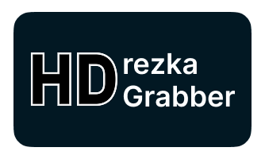
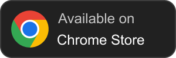
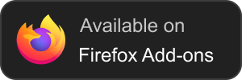
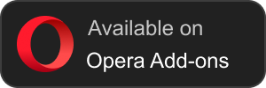
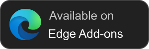
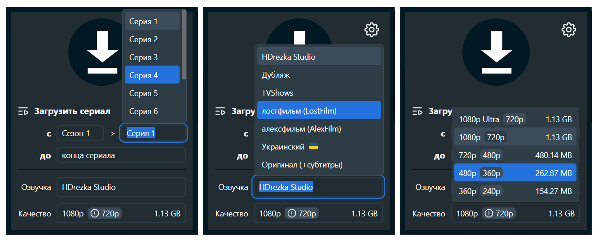

[![Russian][ru-flag]](README.md)
[![English][en-flag]](README-EN.md)
[![Ukrainian][ua-flag]](README-UA.md)

<div align="center">
  

  <br>
  
  
  

  <br>
  
  
  
  
  
  

<h3>Простое решение для загрузки любимых фильмов и сериалов с <a href="https://rezka.ag">rezka.ag</a>!</h3>
</div>

<p align="center">
  <a href="https://chromewebstore.google.com/detail/hdrezka-grabber/aamnmboocelpaiagegjicbefiinkcoal" target="_blank">
    
  </a>
  <a href="" target="_blank">
    
  </a>
  <a href="https://addons.opera.com/ru/extensions/details/hdrezka-grabber/" target="_blank">
    
  </a>
  <a href="" target="_blank">
    
  </a>
</p>

## О расширении

HDrezka Grabber — лучший инструмент для загрузки любимых фильмов и сериалов с сайта [rezka.ag](https://rezka.ag) и любых
его зеркал! Контролируйте всё: выбирайте озвучку, субтитры или, при необходимости, загружайте целые сериалы в один клик.
Настраивайте шаблоны имён файлов для своей медиатеки и ускоряйте процесс с помощью параллельной загрузки. Интуитивно
понятный интерфейс с поддержкой светлой и тёмной темы, а также доступность для большинства браузеров делают этот
инструмент вашим идеальным помощником.

Содержание:

- [О расширении](#о-расширении)
- [Функционал расширения](#функционал-расширения)
- [Как пользоваться расширением](#как-пользоваться-расширением)
- [Сборка из исходников](#сборка-из-исходников)
- [Установка в режиме разработчика](#установка-в-режиме-разработчика)
- [Отказ от ответственности](#отказ-от-ответственности)
- [Поддержка](#поддержка)
- [Лицензия](#лицензия)

## Функционал расширения

- Поддержка всех официальных зеркал
- Возможность загрузки всего сериала в один клик
- Для сериалов доступен выбор диапазона серий для загрузки
- Есть возможность загрузки субтитров (в том числе только субтитров, без видео)
- Параллельная загрузка нескольких фильмов и сериалов
- Загрузка не привязана к странице и происходит в фоне
- Автоматическое определение реального качества видео с предупреждением о занижении качества сайтом
- Отображение размера загружаемого файла
- Позволяет создавать собственные шаблоны для именования загружаемых файлов
- Используется встроенный загрузчик браузера, поэтому расширение загружает файлы сразу на диск
- Доступны тёмная и светлая темы на выбор
- Автоматически подтягивает данные плеера со страницы

## Как пользоваться расширением

- Перейдите на страницу фильма или сериала на сайте [rezka.ag](https://rezka.ag)
- Нажмите на иконку расширения — откроется попап с опциями загрузки
  
- Выберите желаемые опции загрузки в попапе: озвучку, качество, с какой серии/сезона начать и на какой серии/сезоне
  закончить загрузку сериала, а также при наличии субтитры.
  
- После чего запустите загрузку, нажав на большую кнопку с иконкой стрелочки в верхней части попапа.
- Через пару мгновений начнётся загрузка, а вместо иконки стрелочки внутри кнопки будет отображаться текущий прогресс.
  
- Теперь можете повторить с другим фильмом или сериалом — расширение поддерживает очередь загрузок, что позволяет вам
  загружать одновременно несколько разных фильмов/сериалов. А поскольку расширение способно работать в фоне, вам не
  обязательно оставаться на той же странице, на которой вы инициировали загрузку.

> [!WARNING]
> Расширение работает в браузере, если вы закроете браузер, расширение также прекратит работу!

## Сборка из исходников

### Предварительные зависимости

- Node.js (рекомендуется последняя версия)
- npm

> [!NOTE]
> Установить Node.js можно [здесь](https://nodejs.org/en/download).

### Последовательность действий

1. Клонируйте репозиторий:
    ```bash
    git clone https://github.com/kristal374/HDrezka-Grabber.git
    cd HDrezka-Grabber
    ```

2. Установите зависимости:
    ```bash
    npm ci
    ```

3. Запустите сборку расширения:

- Для браузеров на базе Chromium:
  ```bash
  npm run build:chrome
  ```
- Для браузеров на базе Gecko:
  ```bash
  npm run build:firefox
  ```
- Сборка под все поддерживаемые браузеры:
  ```bash
  npm run build:dev
  ```
- Сборка и упаковка в архивы для распространения:
  ```bash
  npm run build:prod
  ```

## Установка в режиме разработчика

Установка расширения в режиме разработчика.

### Для браузеров на базе `Chrome`:

- Откройте браузер и перейдите на страницу расширений: `chrome://extensions`
- В правом верхнем углу включите **Режим разработчика**.
- Нажмите кнопку <kbd>Загрузить распакованное расширение</kbd>.
- Выберите папку с файлами расширения `dist/build/HDrezka-Grabber.chrome`
- Расширение появится в списке и будет готово к использованию.

### Для браузеров на базе `Firefox`:

- Откройте браузер и перейдите по адресу: `about:addons`
- Нажмите на значок шестерёнки, а затем выберите <kbd>Установить дополнение из файла</kbd>.
- Выберите файл `manifest.json` из папки расширения `dist/build/HDrezka-Grabber.firefox`.
- Расширение будет загружено и станет доступным для использования до следующей перезагрузки браузера.

## Отказ от ответственности

> [!CAUTION]
> Настоящее расширение распространяется как свободное программное обеспечение с открытым исходным кодом. Оно
> предоставляет технические средства для взаимодействия с веб-контентом. Расширение не хранит и не распространяет контент
> третьих лиц — оно лишь выполняет локальные операции в браузере по запросу пользователя. Пользователь самостоятельно
> несёт полную ответственность за законность использования расширения в своей юрисдикции и за соблюдение условий
> использования и лицензионных соглашений соответствующих веб-сайтов.

## Поддержка

Пожалуйста, рассмотрите возможность сделать пожертвование для поддержки развития этого проекта с открытым исходным
кодом.
<div align="left">
  Тут ссылки на донаты
</div>

Кроме того, вы можете поставить 5-звёздочный рейтинг в [Chrome web store][chrome-web-store]
или [Mozilla add-ons][mozilla-addons] и отметить этот проект на GitHub.

## Лицензия

[GPL-3.0](LICENSE)

[ru-flag]: https://img.shields.io/badge/Русский-RU-green?logo=data:image/png;base64,iVBORw0KGgoAAAANSUhEUgAAADAAAAAkCAMAAAD4m0k4AAAA81BMVEVHcEzT09OdGhGkHhTR0dHV1dWbGRGZGBCgHBPV1dXR0dGcGRGgGxLU1NTU1NTQ0NCVFxHX19eTExOSEw3///8ANqPLIBUAMZwAPqrRJhrTKBsAM5/PJBjOIhfJHRMAOKbWLB8AOqcAQKsAL5nX19cARa4BQqyWFQ7VKh3WLyLR0dEBLJUAPKnGGxIASLACPpmiHBPc3NyvJR3FIxirHxbx8vSlFw8AJ4IAI3W3HRT4+fnKysq8KB/h4ubm5uY5LHFLeMMPOY+kuN91K1OPMUtcMGdjiMqLpdPu7u5OMG6DnM06ZrcOTLDM2O5/HjJ1mNKXKT/M21+YAAAAFHRSTlMAko/hWnFztlu24UiipEgQKCgU9g6UdlkAAAHuSURBVDjL5dVdV6JQGIZhNJXQ0j4MNc0cdcxJyRGk2hQikGBqH///1/S+7E2yEVpzPs9acuC6bjZLDxCEYKe5fOZYkqTjTD5fPq0IactJcKnkpX5sRSkDXQxXypni7ZNQRm3OV4ZRxRmGvpqb0/4trogn5nBwfhG+6EMAelXdX9DRjK0/nRvVKQTz6k8zdH0F0+n5/xDE9t8GJv54b86Ht8B5H77zpqd5fW1DYPqL7d3db9xgMOh2u/X6duOt9zrTWVw8PAr+BjT1lIOvj8djvGw3C2/tO47jr73NoFnr1SCYTHhfp/4X7hp2QddsNmuwMKB+x8f7PPA9FkRvH+V7ngWhT+ERT4PI46Tx0I9YwPtU3hthYE9C/xNnnga7x+d/mgQ/egwC8Pbr0n3BuctXy47zbz+y3iGYLF/+4Dqd4XCIn8vG86e7tOxa5PboLZfc3wgW1ZSjpmvANPXTxRMtC85/V+V2uw2B+hz1EY5rta6CyXS7oJPgW8F4HwbMp/CIZwHnGzvP8cArQcA9TpzzngVJPOH24GlAfUtjS+DfngUNjcxgf8PNZoRomizL/OMoCvxvEKgq4IOjbOEQV8geiQdhSAhRFKoJuQd9LpYExKWz2LvjpFTIQnfD7VwsoBMPU99P0AUniiKef0K/+wIhQsyL7kuw0wAAAABJRU5ErkJggg==

[en-flag]: https://img.shields.io/badge/English-EN-blue?logo=data:image/png;base64,iVBORw0KGgoAAAANSUhEUgAAADAAAAAkCAMAAAD4m0k4AAABwlBMVEVHcEwAGVEEK2gCH1YAHVUBHlUAFEiqEzACHlYCIFinsrKfDya4tbmhFSyztr3ExsqkqLIjOWvMwcOfDygMM2ygDym6hI3KysoDDz+VACvZ2dkIG029dYOoV1+5ubm9i5Oyqqq6urq6foj////MFTfKETHHDiwAHWLLEzTFDiq+CyTBDSfDDSjIDy4AFlMBMnsAJG0BGFYBLnfOFzoBJm8AFk0AG1v+/v79/PwIKWgCH1wBLG7pp7HkkJ30ztXr7fPol6bmk6EFI2fsq7cLL3ORChwGIWDo6vDtsbu3CiABEkQAED4ONHrV2uXRHEO4GDl4hqqstszX19jgdolgcZn99/j46OzQJUWiCiA/WY7GFjL09fhofKX77O7aXXPzydHRUGPQNk/xxczmnajdZ3zc3eArQXnFzN3i4uXvusPWRWHggI/R0dP13eGgrMXNPVLJIDvAvsAvT4yHlLROaJtOX4T18vXDxszZV26vSFnQy8zuvcXNL0mLnL16j7b14ua4DSYjN2vhiZe0bHg2R3eZpMD12d6vWmY/UHwVP4PUb4LMvMDFeIfDh5GdNkK4OU3DUGvWm6bMkJ28dX7PsLXgz9H2/EKBAAAAI3RSTlMAhrOTYqGx/FV3BVD9mRT3+9tLvCpv4mgqBrHbIyOuxj+0xxxCV0cAAAQdSURBVDjLdZWHVyJJEMbHhJjD5r2wd9czjIeODiJhJIkgoAtIRpAcBBEBRTHnuHlvd+//va4hKe/2ew8er9/3q66qrqYJgtdTYU9HV3t7e1dHT6fwaS/xE73qe4O/B1+8HvIYVSAOPhznev5k4Fnfry3c4OhA990hMfra5XJlzbbQFK/p6WmVMfupG+vb0Eh7VxveUSjs7GkTjPQfrNzlD4nlr9/OlAgrE6gTVjQnJYPL/+Q5k8k0y0suv//w5Xzfm94ilpf9/pQWCOWJFexVAMugs87MzLDzvBy3cSaiRK414uNXv91u348CYttuAiRp0BlneLGs1XlUYlJepNyVEYV0WJ3DSMqHiUqoBpBkE2DZbZueYjYUSOGRyAiVdce5Go3Y7X4NlFKwtgAsO1P2RZhgEiFFiAbAODX17lQXzUmluVs+LVUVGOMBCG/xM/4ErtFD1wEeMfil9jlM6HaMGBgbA4BljWWfm2JiZwh5d+gqoKo2813hLCKVRsI4UhnNjdUAjxmHpza8uLwA/QCwBkInBTNKrK8nFNAuACiDLpC53WeYODTdtgZ+bneY4FTbpxn+5B5IP0ZRlEFZcZPV8MhppOkLj3PVtUfsOsHt1VrmNG63W6+3JDa9SE8BgMJRyxx/prbTmz0z/PhxQLiyyiN3zg4nBa2BXMjj4yrwWErtZXxlgfjw/hjmoOmHbCiKYRgyvu/WqC1akCW5ESuNj4sx0L3c8Dft4AeJRKK/QRNY49jfBBrptNgb/nHeXwfIR/6W6A/9NaDu/9/ozXQaAElK4ymNJaoNh8+0uJEbkWKw1V7zH3/vx8C+2odaDw7sxXhw4oE/mLvUItcWcXUILbY5y440WBOXyfUw0kNwNVKGtRa1BqQ+uoXzXS1fEPms7mbHii9VBi/43IwoqK8oasBj6ZwebuktMRxQwdQHdHjJUBKJUj7nGuwwMaGGOVRYkpYEsp2Edi8kkslJDMyawL+ziucJh/evZwP0PNJD7mqzAyOVmFgc8RU4CfhrAMuGcIK3ORGT8jk4GgMaqFVtNgUquL5kUFzSVxyzk3WAZSHSegmHz/BTDwDuDAbkazac1uaxWFyMZj2mOoD9Cj2Fs3fM0zVgvAbIOScM/8b54mIsUbm5x4B8FvuV70XBZPVSNQAxD0gkoQpsEltcXCwmfXsOQu5RIG9EVIoWOPohIAZAArqGtNBRESPnn++I+zTyxkTFzRAtr8uENDAHdUAyW+av8BHeZWGB2Et7Y+dftq5lTUlcH3G0BoCbc53hr9y/V58XiHz+YOWgf0TQ+F/vEvwydLWA9WlPIpNNViXz5NOHW1v9v/9BHB50D4wOPn46en/rezbw5Hm/bAn0ltfS7vCfL8D3V9+rnz1QvS+FnW0dXQKBAL9kwpfVxf8ABj55g+3Y6poAAAAASUVORK5CYII=

[ua-flag]: https://img.shields.io/badge/Українська-UA-blue?logo=data:image/png;base64,iVBORw0KGgoAAAANSUhEUgAAADAAAAAkCAMAAAD4m0k4AAAA1VBMVEVHcEzFnwC9lADBmwDFoAADVqACYKcASZrMpAAAZKsAVqACWaICWqIFYKcBUp3IpAC5kgDGoQAHWKC1lQC8kgD/1QD/zAD/1AD/zwAAZMD/0AD/2QAAWLn/yQD/1wAAXLwAXr0AYb8AZsEAaMIAbsUAWrv/0gAAcccAVbcAasMAU7UAbMQDXqYAUbO+lQAAYL7CnQTevwv+xgAAQpACaLQAXrHvwwPWqQAAUJ7QrQDTsgAAWaPitwA8e48ATrEobJuPnlGvsTzuzw1vimX2ywBHhY5BXVhJX/sAAAAAFXRSTlMAk6xzV1y0/v7+o492O9i7Ld0ZEPbmdQ7iAAACFElEQVQ4y43V13KqUBQGYCwIdmMCFoyagDFGVEBKFAy2c97/kbJ2oW6Zyc/IhfP9ay+4geNw2nyr2ajVao1mi2/3ucLwHbj1+VodR8fxdd/v1JotptfnG4IgcG2kbXulaUtN09Yr1bYdBzooHXwiCpzfEXA4u25rSxwNFdbrFURV33eO4/vfUQQBbpvPyfeeq9vL2K+JVyHvkNFo9AY9lMliNlssJulCPD7FoQDZzefzGfETISqQdcg2CUd+R/wC+7iQHp/hyXjsP2kh51M852khWodZnnKyPvJfUNDtrM/y1HjkcaFOfBFP1gG/IQXWM5x6UiA+/+ajbZJ1wG/2UHDSPvOs8fjY/+BC1rPbkHWwRwXfwX5khyeU0E4463/2/6Ggrv6dL1dpiiNJV/Nyvp1CqiknPrwZBuefLldFUaZKVJCmcEkD2tPJ+C89vJ1NWfYMzjAVagmnGQw+cMZD1zRNVx7CJePC0XzgB7Efo994CJGZAsuRpZx4Usj5PE/7V28bF/LLP+Dya1J4sHzCEx8XmHdT4KPCX8ZjTwuPx2c58RYUDmbWj4vHZwp/GA/eEqEQsONzPPFxAfz97uLc5QKOPC3c3eBwEKMYoncIAtdix1uBuIXC8Qj6qVuqVFEqpVL3ycARPei5loW06wYe6JdyjwNdqj7nvh09KOLeFl00L+UKct1q4ffpuYdOLKPA+T3y5y+LT8+ZR7lnbAAAAABJRU5ErkJggg==

[chrome-web-store]: https://chromewebstore.google.com/detail/hdrezka-grabber/aamnmboocelpaiagegjicbefiinkcoal

[mozilla-addons]: https://addons.mozilla.org/ru/firefox/addon/hdrezka-grabber/
